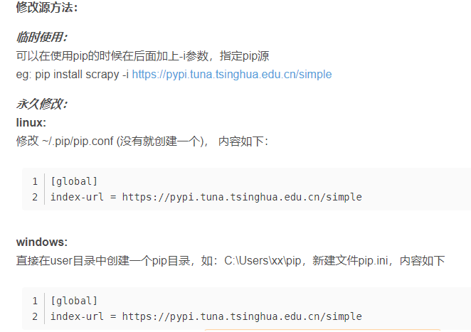

pip源

> pip list
>
>
> pip list --outdated		查看可以更新的第三方库
>
> pip install --upgrade numpy	更新库
>
> pip install <>
>
> pip uninstall <>
>
> pip install scrapy -i https://pypi.tuna.tsinghua.edu.cn/simple		临时修改源
> pip国内的一些镜像
>   阿里云 http://mirrors.aliyun.com/pypi/simple/
>   中国科技大学 https://pypi.mirrors.ustc.edu.cn/simple/
>   豆瓣(douban) http://pypi.douban.com/simple/
>   清华大学 https://pypi.tuna.tsinghua.edu.cn/simple/
>   中国科学技术大学 http://pypi.mirrors.ustc.edu.cn/simple/
>   
>
> pip3 install libra-client-sdk  -i http://mirrors.aliyun.com/pypi/simple/ --trusted-host mirrors.aliyun.com

更新源的方法：

