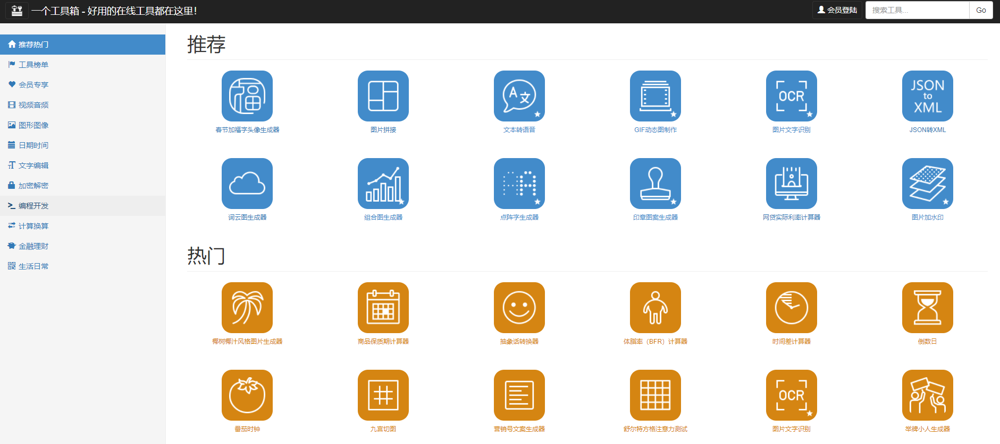

# 有用的工具

## 1.编程
- 在线预览代码
在打开的github仓库中，加后缀 1s(数字1和字母s),如：https://github.com/wodingdong/use-vscode-writen-c, 修改后
https://github1s.com/wodingdong/use-vscode-writen-c

## 2.工具

- 一个工具箱 http://www.atoolbox.net/

  

- EPUB转化工具 https://epub.to/

  

- 

